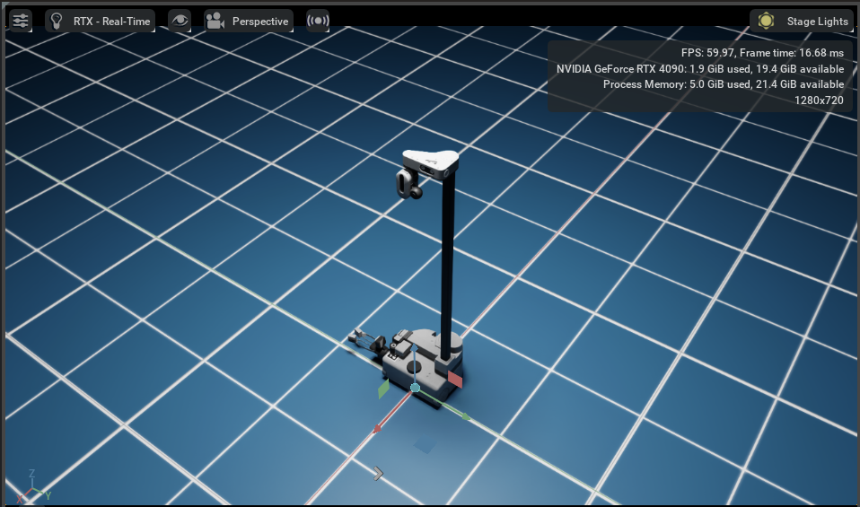

# stretch IsaacSim

This repository adds preliminary support for Stretch on Isaac Sim.

## Usage

To use Stretch in Isaac Sim, simply use MJCF Importer and import `models/stretch.xml` into your simulation. To open MJCF Importer, navigate to `Isaac Utils -> Workflows -> MJCF Importer`. Or alternatively, you can directly use `models/stretch.usd`. Note that support for base lidar is a work in progress.

### Feature Requests and Bug reporting

All the enhancements/missing features/Bugfixes are tracked by [Issues](https://github.com/hello-robot/stretch_isaacsim/issues) filed. Please feel free to file an issue if you would like to report bugs or request a feature addition.

## Acknowledgment

The assets in this repository contain significant contributions and efforts from [Kevin Zakka](https://github.com/kevinzakka) and [Google Deepmind](https://github.com/google-deepmind), along with others in Hello Robot Inc. who helped us in modeling Stretch in Isaac Sim. Thank you for your contributions.

